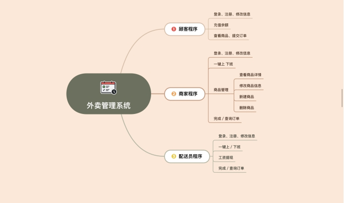
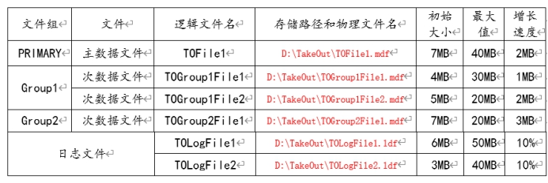

 # 数据库大作业

## 系统设计与实现

### 一、摘要

**（概括性介绍应用系统的意义，体系结构，开发及运行所需的软件环境，用户类型及各类用户具备的主要功能模块）**

这里将设计一个网上购物系统，类似于饿了么。本系统采用B/S结构，语言采用java制作后端，jsp和web作为前端，分为前端服务功能模块和后端管理功能模块。服务对象可以分为商户和顾客还有外卖员，商户可以开虚拟网络店铺，在店铺里可以放有关商品，顾客可以浏览店铺里的商品进行购买或者加入购物车，也可以和店家进行沟通，外卖员可以接订单，取消订单，完成订单。管理员可以控制和监管商家和用户的行为（创建、上架、购买、大数据分析等...）。

### 二、系统主要功能模块

**（用户类型及不同类型用户具备的主要功能模块）**



 

### 三、E-R图

**（暂时不画，进一步分析、规划）**

**说明：画出E-R****图。**

 

### 四、数据库设计

#### 1、数据库物理文件组织

 

```sql
CREATE DATABASE TakeOut

ON PRIMARY

(NAME=TOFile1,

FILENAME='D:\TakeOut\TOFile1.mdf',

SIZE=7MB,

MAXSIZE=40MB,

FILEGROWTH=2MB),

 

FILEGROUP Group1

(NAME=TOGroup1File1,

FILENAME='D:\TakeOut\TOGroup1File1.mdf',

SIZE=4MB,

MAXSIZE=30MB,

FILEGROWTH=1MB),

(NAME=TOGroup1File2,

FILENAME='D:\TakeOut\TOGroup1File2.mdf',

SIZE=5MB,

MAXSIZE=20MB,

FILEGROWTH=2MB),


FILEGROUP GROUP2

(NAME=TOGroup2File1,

FILENAME='D:\TakeOut\TOGroup2File1.mdf',

SIZE=7MB,

MAXSIZE=20MB,

FILEGROWTH=3MB)

 

LOG ON

(NAME=TOLogFile1,

FILENAME='D:\TakeOut\TOLogFile1.ldf',

SIZE=6MB,

MAXSIZE=50MB,

FILEGROWTH=10%),

 

(NAME=TOLogFile2,

FILENAME='D:\TakeOut\TOLogFile2.ldf',

SIZE=3MB,

MAXSIZE=40MB,

FILEGROWTH=10%)

GO
```

#### 2、数据库表结构设计

系统数据库各表的设计情况如下：

商店表（Store）：存储商店信息。

商店表（Store）

| 字段名称 | 字段类型      | 键码 | 其它完整性约束 | 属性含义   |
| -------- | ------------- | ---- | -------------- | ---------- |
| Sno      | varchar(20)   | 主键 | Not null       | 商店号     |
| Spass    | varchar(20)   |      | Not null       | 商店密码   |
| Sname    | varchar(50)   |      | Not null       | 商店名称   |
| Saddr    | varchar(50)   |      | Not null       | 商店地址   |
| Stel     | varchar(12)   |      | Not null       | 商店电话   |
| Smoney   | decimal(18,2) |      | Not null,0     | 商店营业额 |
| Sstate   | varchar(20)   |      | Not null       | 商店状态   |


商品表（Goods）：存储商品信息，如表所示。

商品表(Goods)

| 字段名称 | 字段类型      | 键码 | 其它完整性约束 | 属性含义 |
| -------- | ------------- | ---- | -------------- | -------- |
| Gno      | varchar(20)   | 主键 | Not null       | 商品编号 |
| Sno      | varchar(20)   |      | Not null       | 商店编号 |
| Gname    | varchar(50)   |      | Not null       | 商品名称 |
| Gprice   | decimal(18,2) |      | Not null,0     | 商品价格 |
| Gstock   | int           |      | Not null       | 商品库存 |


顾客表（Customer）：存储顾客信息。

顾客表(Customer)

| 字段名称 | 字段类型      | 键码 | 其它完整性约束 | 属性含义 |
| -------- | ------------- | ---- | -------------- | -------- |
| Cno      | varchar(20)   | 主键 |                | 顾客ID   |
| Cpass    | varchar(20)   |      | Not null       | 登录密码 |
| Cname    | varchar(50)   |      |                | 姓名     |
| Csex     | varchar(2)    |      |                | 性别     |
| Caddress | varchar(50)   |      |                | 地址     |
| Ctel     | varchar(12)   |      | Not null       | 电话     |
| Cmoney   | decimal(18,2) |      | 0              |          |

 

 

派送员表（Deliever）：存储派送员信息。

| 字段名称 | 字段类型      | 键码 | 其它完整性约束 | 属性含义 |
| -------- | ------------- | ---- | -------------- | -------- |
| Dno      | varchar(20)   | 主键 |                | 派送员ID |
| Dpass    | varchar(20)   |      | Not null       | 登录密码 |
| Dname    | varchar(50)   |      |                | 姓名     |
| Dsex     | varchar(2)    |      |                | 性别     |
| Dstate   | varchar(20)   |      |                | 状态     |
| Ctel     | varchar(12)   |      | Not null       | 电话     |
| Dmoney   | decimal(18,2) |      | 0              |          |

 

订单表（Order）：存储订单信息。

| 字段名称 | 字段类型      | 键码 | 其它完整性约束 | 属性含义 |
| -------- | ------------- | ---- | -------------- | -------- |
| Ono      | varchar(20)   | 主键 | Not null       | 订单号   |
| Dno      | varchar(20)   |      |                | 骑手号   |
| Cno      | varchar(20)   |      | Not null       | 顾客ID   |
| Sno      | varchar(20)   |      | Not null       | 商店ID   |
| Ostate   | varchar(20)   |      | Not null       | 状态     |
| Otip     | varchar(100)  |      | Not null       | 备注     |
| ODelfee  | decimal(18,2) |      | 0              | 配送费   |
| Omoney   | decimal(18,2) |      | 0              | 金额     |
| Obtime   | datetime      |      |                | 发起时间 |

 

订单详情表（Purchase）：存储订单详情信息。

| 字段名称 | 字段类型    | 键码 | 其它完整性约束 | 属性含义 |
| -------- | ----------- | ---- | -------------- | -------- |
| Ono      | varchar(20) | 主键 |                | 订单号   |
| Gno      | varchar(20) |      | Not null       | 商品号   |
| Pamount  | int         |      |                | 数量     |


### 五、数据库关系图

**说明：SQL** **Server中****创建关系****图****，将图插入****此处。**

### 六、数据库触发器设计

#### 1. orders上的触发器

- Store_off：店家休息无法购买，提示

  ```sql
  --商家状态为休息时添加商品后ROLLBACK订单
  Create TRIGGER [dbo].[Store_off]
  on [dbo].[orders]
  After INSERT,UPDATE
  AS
  BEGIN
  	DECLARE @store_num varchar(20),@state varchar(20)
  	
  	select @store_num=Sno from inserted
  	select @state=Sstate from store where Sno=@store_num
  	if(@state='休息')
  	BEGIN
  		PRINT '商家正在休息，订单自动取消'
  		ROLLBACK transaction
  	END
  END
  
  ```

- 支付：用户完成支付发生状态转变，进行金钱之间的转移

  顾客支付后，订单状态由订单完成转变为正在出餐。

  ```sql
  Create trigger [dbo].[支付]
  on [dbo].[orders]
  after update
  as
  begin 
  	declare @fee decimal(18,2),@Omoney decimal(18,2),@Cmoney decimal(18,2),@Ono varchar(20),@Cno varchar(20),@Sno varchar(20),@Nstate varchar(20),@Ostate varchar(20)
  	select @Ono=Ono,@Cno=Cno,@Sno=Sno,@Nstate=Ostate,@Omoney=Omoney,@fee=ODelfee from inserted
  	select @Ostate=Ostate from deleted
  
  	if(@Ostate='订单完成' and @Nstate='正在出餐')
  			/*
  			if(@Omoney+@fee>@Cmoney)
  			begin
  				print'余额不足，订单自动取消'		--实现功能时记得保存订单到临时表
  				ROLLBACK TRANSACTION
  			end
  			*/
  			begin
  				update customer
  				set Cmoney-=@Omoney
  				where Cno=@Cno
  
  				update customer
  				set Cmoney-=@fee
  				where Cno=@Cno
  
  				update store
  				set Smoney+=@Omoney
  				where Sno=@Sno
  			end
  end
  ```

  

- 骑手接单：发生正在配餐到正在配送的过程，给骑手加钱

```sql
Create trigger [dbo].[骑手接单]
on [dbo].[orders]
after update
as
begin 
	declare @Dno varchar(20),@Nstate varchar(20),@Ostate varchar(20),@fee decimal(18,2)
	select @Dno=Dno,@Nstate=Ostate,@fee=ODelfee from inserted
	select @Ostate=Ostate from deleted

	if(@Nstate='正在配送' and @Ostate='正在出餐')
		begin 
			update deliverer
			set Dmoney+=@fee
			where Dno=@Dno
		end
end
```


- 订单取消：顾客退订订单，删除订单，骑手金钱减少，批处理(商品数量恢复，顾客金钱恢复，商店金钱减少)

  这是一个批处理操作，因为一个订单对应好多的purchase表项，所以采用临时表的方法来存储需要删除的表项，然后while循环逐一删除

  正在配送：骑手减少金钱，顾客恢复配送费
  
  正在出餐：顾客恢复配送费
  
  若是正在配送or 正在出餐状态下：恢复商品数目，恢复顾客金钱，恢复商店金钱
  
  若是订单完成下：只恢复商品数量
  
  ```sql
  Create trigger [dbo].[订单取消]
  on [dbo].[orders]
  instead of delete
  as 
  begin 
  	SET NOCOUNT ON;
  --新建一张临时表，并加入一个自增主键ID，便于后面的循环操作
  	Create table #temp
  		(ID int IDENTITY(1,1) PRIMARY KEY,
  		Sno varchar(20),
  		Gno varchar(20),
  		pamount int
  		)
  	
  	declare @DOno varchar(20),@DCno varchar(20),@DDno varchar(20),@fee decimal(18,2),@state varchar(20)
  	select @DOno=Ono,@DCno=Cno,@DDno=Dno,@fee=ODelfee,@state=Ostate from deleted
  	--正在配送：骑手减少金钱，顾客恢复配送费
  	if @state='正在配送'
  	begin 
  		update deliverer
  		set Dmoney-=@fee
  		where Dno=@DDno
  		
  		update customer
  		set Cmoney+=@fee
  		where Cno=@DCno
  	end
  	--正在出餐：顾客恢复配送费
  	if @state='正在出餐'
  	begin
  		update customer
  		set Cmoney+=@fee
  		where Cno=@DCno
  	end
  	--向临时表中插入数据
  	Insert into #temp
  	(Sno,Gno,pamount)
  	select o.Sno,p.Gno,p.pamount from purchase p,orders o where p.Ono=@DOno and o.Ono=@DOno
  	--遍历临时表中的数据，开始按每一行恢复
  	declare @i int=1,@size int=0
  	select @size = MAX([ID]) from #temp
  	print(@size)
  	while @i<=@size
  		begin
  			declare @DGno varchar(20),@DSno varchar(20),@Dpamount int,@price decimal(18,2)
  			select @DGno=Gno,@DSno=Sno,@Dpamount=pamount from #temp where ID=@i
  			select @price=Gprice from goods where Gno=@DGno
  			if @state='正在配送' or @state = '正在出餐'
  			begin
  			--恢复商品数目
  				update goods
  				set Gstock+=@Dpamount
  				where Gno=@DGno and Sno=@DSno
  			--恢复顾客金钱
  				update customer
  				set Cmoney+=@Dpamount*@price
  				where Cno=@DCno
  			--恢复商店金钱
  				update store
  				set Smoney-=@Dpamount*@price
  				where Sno=@DSno
  				--级联操作代替了删除的行为
  				--delete from purchase where Gno=@DGno and Ono=@DOno
  			end
  			if @state='订单完成'
  			begin
  			--只恢复商品数量
  				update goods
  				set Gstock+=@Dpamount
  				where Gno=@DGno and Sno=@DSno
  			end
  			Set @i=@i+1
  		end
  		--删除orders的一行
  		delete from orders where  @DOno=Ono
  end
  ```

#### 2. purchase 触发器

- 加入购物单：物品加入购物单会使物品数量减少，增加订单金额

```sql
Create trigger [dbo].[加入购物单]
on [dbo].[purchase]
after insert
as
begin
	declare @Ono varchar(20),@Gno varchar(20),@price int,@mount int

	select @Ono=Ono,@Gno=Gno,@mount=pamount from inserted
	select @price=g.Gprice from goods g where g.Gno=@Gno

	begin
		update orders
		set Omoney+=@price*@mount
		where @Ono=Ono

		update goods
		set Gstock-=@mount
		where @Gno=Gno
	end
end
```

#### 测试样例

~~~sql
insert into orders(Ono,Cno,Sno,Ostate,ODelfee,Omoney) values('001','001','001','订单完成',5,0)

insert into purchase(Ono,Gno,pamount) values('001','001',1)
insert into purchase(Ono,Gno,pamount) values('001','002',2)

update orders
set  Ostate='正在出餐'
where Ono='001'

update orders
set Dno='001'
where Ono='001'

update orders
set  Ostate='正在配送'
where Ono='001'

delete from orders where Ono='001'
~~~

 

**其它****内容待续。。。。。。**
